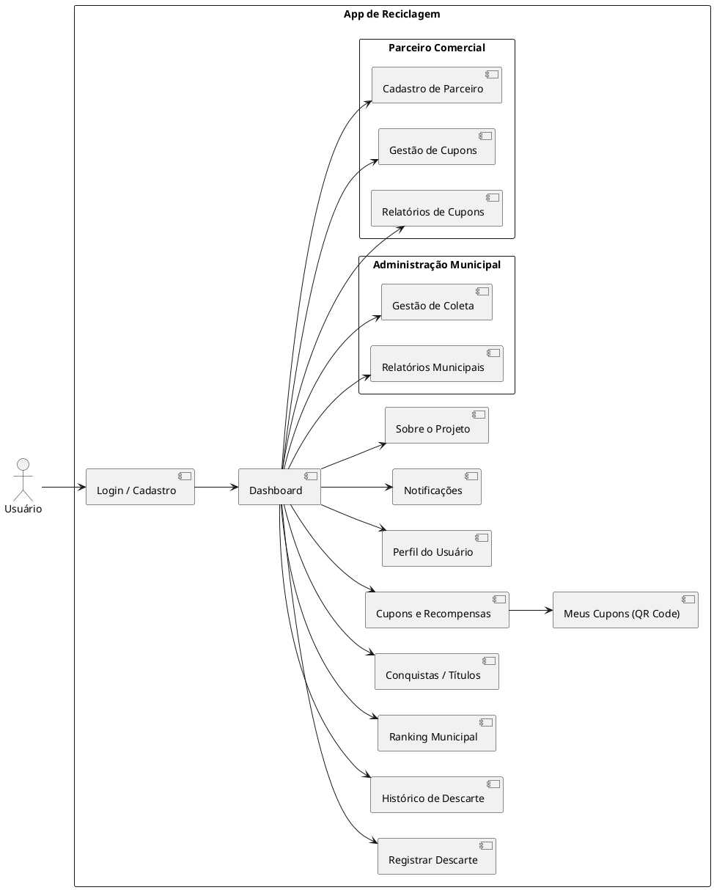

# Aplicativo de Coleta e Descarte de Resíduos

## Sumário
- [Visão Geral](#visão-geral)
- [Atores do Sistema](#1-atores-do-sistema)
- [Requisitos Funcionais](#2-requisitos-funcionais)
  - [Módulo Usuário](#21-módulo-usuário)
  - [Módulo Administração](#22-módulo-administração)
  - [Módulo Comércio Parceiro](#23-módulo-comércio-parceiro)
- [Telas do Aplicativo](#3-telas-do-aplicativo)
  - [Módulo Usuário](#31-módulo-usuário)
  - [Módulo Administração](#32-módulo-administração)
  - [Módulo Parceiros](#33-módulo-parceiros)
- [Casos de Uso](#4-casos-de-uso)
- [Diagrama de Navegação](#5-diagrama-de-navegação)
- [Objetivo do Projeto](#6-objetivo-do-projeto)

---

## Visão Geral
O aplicativo foi desenvolvido para auxiliar a população e a administração municipal no gerenciamento da coleta seletiva de resíduos. Ele integra cidadãos, órgãos de gestão de resíduos e parceiros comerciais, promovendo práticas sustentáveis e incentivando a reciclagem por meio de recompensas e gamificação.

---

## 1. Atores do Sistema
- **Usuário Cidadão:** Morador da cidade que utiliza o aplicativo para registrar descartes, acompanhar notificações e resgatar cupons.  
- **Administração:** Órgão gestor responsável pela definição do calendário de coletas, relatórios e rankings.  
- **Parceiro Comercial:** Estabelecimentos que oferecem cupons e benefícios aos usuários.  
- **Sistema de Notificações:** Responsável por enviar avisos de coleta, promoções e conquistas.

---

## 2. Requisitos Funcionais

### 2.1. Módulo Usuário
- RF-01: Cadastro e login de usuários.  
- RF-02: Identificação de região por geolocalização.  
- RF-03: Envio de notificações de coleta.  
- RF-04: Registro e histórico de descartes.  
- RF-05: Conquista de títulos e medalhas por metas atingidas.  
- RF-06: Ranking municipal com classificação dos usuários.  
- RF-07: Resgate de cupons de parceiros comerciais.  
- RF-08: Geração de código escaneável para identificação do descarte.  

### 2.2. Módulo Administração
- RF-09: Cadastro e gerenciamento do calendário de coleta.  
- RF-10: Relatórios e estatísticas por bairro, região e município.  

### 2.3. Módulo Comércio Parceiro
- RF-11: Cadastro de parceiros.  
- RF-12: Gestão de cupons de desconto.  
- RF-13: Relatórios de cupons utilizados.  

---

## 3. Telas do Aplicativo

### 3.1. Módulo Usuário
- **Tela de Login / Cadastro**: Criação de conta, login via e-mail ou Google, recuperação de senha.  
- **Dashboard**: Resumo do histórico, próximas coletas, acesso rápido a ranking e cupons.  
- **Registro de Descarte**: Formulário para informar tipo e quantidade de resíduo.  
- **Histórico de Descarte**: Lista detalhada com filtros por material.  
- **Ranking Municipal**: Exibição do ranking geral e posição do usuário.  
- **Conquistas / Títulos**: Ícones desbloqueados e progresso para próximos títulos.  
- **Cupons e Recompensas**: Listagem e resgate de cupons.  
- **Perfil do Usuário**: Dados pessoais e endereço.  
- **Notificações**: Histórico de avisos de coleta, conquistas e promoções.  
- **Sobre o Projeto**: Informações sobre sustentabilidade e parceiros oficiais.  

### 3.2. Módulo Administração
- **Gestão de Calendário de Coleta**.  
- **Relatórios Municipais**.  

### 3.3. Módulo Parceiros
- **Cadastro de Parceiro**.  
- **Gestão de Cupons**.  
- **Relatórios de Cupons Usados**.  

---

## 4. Casos de Uso
- **UC01 – Cadastrar Usuário**: Usuário cria sua conta.  
- **UC02 – Receber Notificação de Coleta**: Sistema envia aviso prévio da coleta.  
- **UC03 – Registrar Descarte**: Usuário informa tipo e quantidade de resíduos descartados.  
- **UC04 – Consultar Histórico e Ranking**: Usuário acompanha dados e posição no ranking.  
- **UC05 – Resgatar Cupom**: Usuário troca pontos acumulados por cupons.  
- **UC06 – Cadastrar Parceiro Comercial**: Estabelecimento se torna parceiro oficial.  
- **UC07 – Gerenciar Cupons**: Parceiro cria e edita cupons.  
- **UC08 – Gerenciar Calendário de Coleta**: Administração atualiza rotas e horários.  

---

## 5. Diagrama de Navegação
Cole o código abaixo no [PlantText Editor](https://www.planttext.com/) para visualizar:

---

## 6. Objetivo do Projeto
- Incentivar a participação da população no descarte consciente.  
- Facilitar a comunicação entre município, cidadãos e parceiros comerciais.  
- Promover benefícios sociais e econômicos por meio de cupons e descontos.  
- Aumentar os índices de reciclagem e sustentabilidade no município.  
